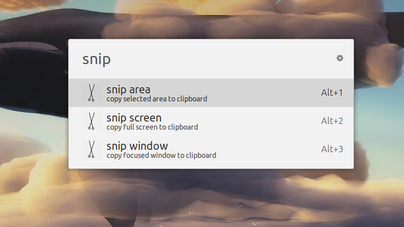

# Fork
Tweaked to work with xfce4 screenshot tool.

Original project: https://github.com/Jasdent/ulauncher-snip

Icons made by <a href="https://www.freepik.com/" title="Freepik">Freepik</a> from <a href="https://www.flaticon.com/" 			    title="Flaticon">www.flaticon.com</a> is licensed by <a href="http://creativecommons.org/licenses/by/3.0/" 			    title="Creative Commons BY 3.0" target="_blank">CC 3.0 BY</a>

# ulauncher-xfce-ss
Ulauncher-extension
Xfce4 ScreenShoting is now easy.  
Currently supported options:
- ss an area
- ss whole screen
- ss a focused window: ss window [int delay]

Just a tip, if you write it on your own and put it in the extension folder, it simply not gonna work. Somehow it has to be downloaded from github via ulauncher.

